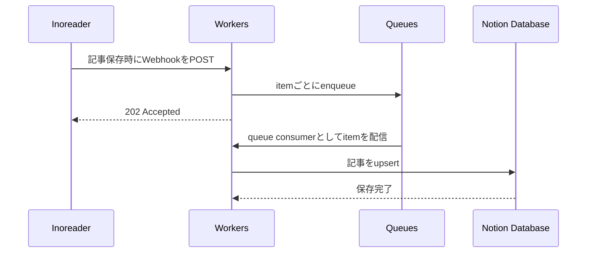

## Overview

Inoreader保存（後で読む）した記事を、Notionの data source に追加するためのCloudflare Workersです。

## Flow

## Tech Stack

| Layer | Details |
| --- | --- |
| Platform, Framework | Cloudflare Workers (using Hono) and various Cloudflare services |
| Language | TypeScript 6 |
| Linting, Formatting | Biome |
