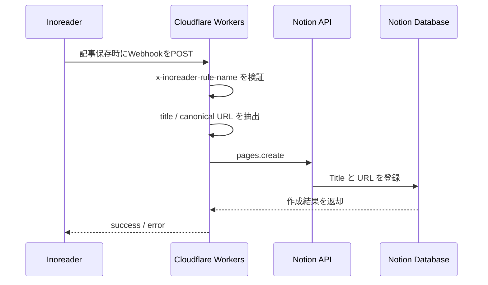

## Overview

Inoreader保存（後で読む）した記事を、Notionのデータベースに追加するためのCloudflare Workersです。

## Flow

```mermaid
sequenceDiagram
    participant Inoreader
    participant Worker as Cloudflare Workers
    participant NotionAPI as Notion API
    participant Database as Notion Database

    Inoreader->>Worker: 記事保存時にWebhookをPOST
    Worker->>Worker: x-inoreader-rule-name を検証
    Worker->>Worker: title / canonical URL を抽出
    Worker->>NotionAPI: pages.create
    NotionAPI->>Database: Title と URL を登録
    Database-->>Worker: 作成結果を返却
    Worker-->>Inoreader: success / error
```

## Tech Stack

| Layer | Details |
| --- | --- |
| Server | Hono |
| Deploy | Cloudflare Workers |
