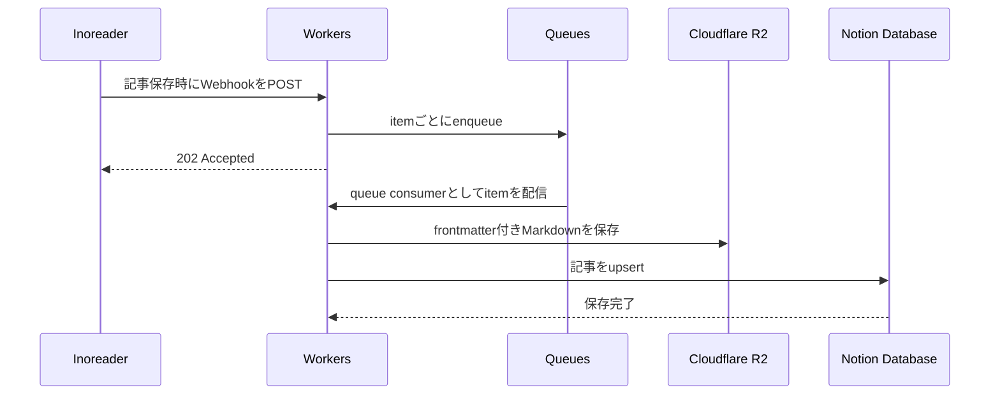

## Overview

Inoreader保存（後で読む）した記事を、Notionの data source に追加するためのCloudflare Workersです。

## Flow

## Setup Notes

- Development shell is provided via `nix develop`.
- Cloudflare R2 bucket binding `WEB_CLIPPINGS` を設定します。bucket実名は環境ごとに分けて構いません。
- Notion data source には既存の `title` / `url` / `updated` に加えて `created` の date property を追加します。
- R2 には Obsidian 向けの frontmatter 付き Markdown を `clippings/YYYY-MM-DD-HHMM-<url-hash>.md` 形式で保存します。

## Development

1. Install Nix with flakes enabled.
2. If you use direnv, run `direnv allow` to auto-load the flake shell.
3. Otherwise, enter the development shell with `nix develop`.
4. Install dependencies with `pnpm install --frozen-lockfile`.
5. Copy `.dev.vars.example` to `.dev.vars` and fill in the required secrets.
6. Run `pnpm dev`, `pnpm test`, or `pnpm check`.

If you are not using Nix, provide Node 24 and `pnpm@11.0.8` yourself before running the same commands.

## Tech Stack

| Layer | Details |
| --- | --- |
| Platform, Framework | Cloudflare Workers (using Hono) and various Cloudflare services |
| Language | TypeScript 6 |
| Linting, Formatting | Biome |
